# ElevenLabs voice pilot

Plan researched 2026-09-12; first implementation completed in the same session. See [VOICE_SETUP.md](VOICE_SETUP.md) for current setup and environment names. Audio creation, private preview, revision approval, shared weekly medium selection, recipient phone verification and gated Twilio dispatch are now implemented. Provider behavior is tested with mocks; live ElevenLabs and phone rehearsal depend on the user's configured accounts.

**Build prerecorded voice first:** the sender writes context, Gemini drafts a short script, the sender edits it, ElevenLabs produces audio, and Twilio calls an opted-in participant. A keypad response updates the match through a verified callback. This adds useful technical depth while keeping the existing Home, Bait and League navigation.

## What is feasible today

| Option | What the participant experiences | Readiness and estimate |
| --- | --- | --- |
| Audio in Bait | Review an editable script, create audio, play it and approve that revision | Implemented; requires a working ElevenLabs key and stock voice |
| Prerecorded phone call | Their verified phone rings, plays the labeled game message, and accepts a keypad response | Implemented behind explicit phone-demo gates; requires Twilio account eligibility, recipient verification and public HTTPS rehearsal |
| Live ElevenLabs Agent | A disclosed AI caller listens and responds conversationally | Separate stretch; roughly 3–5 additional engineering days for a bounded prototype and evaluation |

The live-agent estimate remains a planning estimate, not a provider onboarding promise. With no Twilio setup, demonstrate generated browser audio and the explicit phone readiness state. With no ElevenLabs access, use the readable script; the implementation does not substitute another engine or invent a playable recording.

## Existing foundations and missing pieces

`apps/api/src/providers.ts` already has a TTS adapter, private audio cache, Twilio call submission, scoped media URLs, signed status callbacks and keypad decisions. `ApprovedContent.voiceScript` exists in the shared domain. The adapter currently uses `eleven_multilingual_v2`, requests `pcm_16000`, measures a 15–25 second audio duration and wraps the result as WAV. It caches by voice/model/script hash. Those are repository behavior, not provider latency guarantees.

The `email-casts-v2` rules now share two regular weekly slots across Email, Text and Voice, plus the seasonal Spear. Phone ownership is added by a separate authenticated Twilio Verify flow; participants still choose their own channel opt-ins. The new `twilio-demo` path requires the verified-email `smtp-demo`, explicit phone/channel switches, public HTTPS and provider eligibility. **Adding an ElevenLabs key alone will not make this app call anyone.** Legacy live mode retains its existing identity/storage/provider requirements. See [VOICE_SETUP.md](VOICE_SETUP.md) for current behavior and [INTEGRATIONS.md](INTEGRATIONS.md) for adapter details.

## Implemented participant flow

1. In Settings, a participant optionally adds and verifies their own phone number, enables voice contact and selects a contact window. Store their consent and verified destination privately; opponents never type a destination. Limit the pilot to enrolled adults and a small organizer-approved group.
2. In Bait, an optional Voice choice reuses the sender's context. Gemini returns one short editable fictional script. The backend validates the script and preserves its revision. Use a licensed stock voice, never a cloned participant or a real-person impersonation.
3. **Create audio** starts asynchronous synthesis with persisted status. The sender plays and approves the resulting revision. A script edit, regeneration or medium change invalidates previous audio approval. Restarted unfinished synthesis becomes an explicit retryable failure; stale results cannot replace edited drafts. **Send call** requires that exact approved cache and an eligible recipient, and never synthesizes during sending.
4. The call opens with a clear disclosure such as “This is an AI-generated Fantasy Phishing game call you opted into.” It then plays the reviewed script and asks for a game response: 1 to take the bait, 2 to flag it, or 9 to pause future calls. Do not record or transcribe the recipient in this first version.
5. The app shows audio creation/approval state and actual submission or transport evidence. A carrier's acceptance is not represented as a completed call or a human response.

ElevenLabs' [Create speech API](https://elevenlabs.io/docs/api-reference/text-to-speech/convert) converts supplied text and a selected voice into audio. For this prerecorded design, retain the existing WAV playback path and precompute audio before dialing. A later streaming implementation can evaluate the telephony format in ElevenLabs' [Twilio audio guide](https://elevenlabs.io/docs/eleven-api/guides/how-to/text-to-speech/twilio); it is a different transport design, not a required rewrite now.

```mermaid
flowchart LR
  A[Sender context] --> B[Gemini script]
  B --> C[Edit and approve revision]
  C --> D[ElevenLabs audio job]
  D --> E[Private cached audio]
  E --> F[Consent and quota check]
  F --> G[Twilio call]
  G --> H[Keypad callback]
  H --> I[Validate signature and attempt]
  I --> J[One score event]
  J --> K[Existing match result]
```

## Scoring and reliability

The implemented weekly selector shares the existing two regular slots and seasonal Spear across media; there is no additional voice-only allowance. Taking the bait gives the sender +3 and recipient −1. An explicit flag earns the recipient +1 at the week deadline; voice requires that explicit flag, so unanswered calls, voicemail and generic call completion earn no voice avoidance point. Delivered unclicked email or SMS retain end-of-week avoidance. Scoring stays in the server, independently of the speech model or carrier. Real-phone readiness keeps the recipient's contact window and per-channel daily limit.

The current callback structure can support the following implementation:

- Persist the script revision, audio hash, attempt ID and recipient binding before submission. Recheck current consent, pause state, deadline and quota after synthesis and just before the carrier request.
- Use Twilio's [Gather](https://www.twilio.com/docs/voice/twiml/gather) with DTMF only and an explicit empty-result callback. Distinguish a digit from a transport update; silence is not recognition of bait.
- Validate the Twilio signature against the exact public request URL and form fields, then check AccountSid, CallSid, intended recipient and active attempt. Twilio documents [request validation](https://www.twilio.com/docs/usage/security#validating-requests); our database must separately reject replayed or misbound decisions.
- Append the decision and score once in the same transaction. A signed callback authenticates the carrier; it does not prove which human used a shared phone. For competitive play requiring stronger attribution, confirm the result in the participant's signed-in app before final scoring.
- Keep an uncertain carrier submission unresolved and reconcile by provider ID. Do not retry a call blindly. Invalid audio, a revoked opt-in or an expired match must block calling. Missing callbacks should show unresolved status and produce no score.

Acceptance tests should cover a script edited during generation, restart with a pending audio job, opt-out during synthesis, duplicate/forged callbacks, callback arriving before the create-call response, and an ambiguous send with no automatic redial. Demonstrating these failure paths is stronger evidence of technical difficulty than merely invoking a TTS API.

## Credentials and hosting

Needed for the proposed phone pilot:

- Gemini access for real script generation; ElevenLabs API key, accessible stock voice ID, and enough synthesis credits. New private audio creation requires `ELEVENLABS_STOCK_VOICE_CONFIRMED=true`. `ELEVENLABS_PERMISSION_REFERENCE` remains a legacy full-live gate, not a browser-preview requirement.
- Twilio account credentials, a number/caller setup authorized by that account, and a consenting verified recipient. The current adapter expects `TWILIO_ACCOUNT_SID`, `TWILIO_AUTH_TOKEN` and `TWILIO_VOICE_FROM`; new trial request shapes may need a dedicated adapter.
- Public HTTPS for the API callbacks and scoped audio URLs. `npm run email:demo` serves loopback only; a carrier cannot fetch audio or send callbacks to `127.0.0.1`. Deploy the API or use a stable HTTPS tunnel, configure `API_ORIGIN`/`TWILIO_CALLBACK_BASE`, and test the exact public signature URL.

**Twilio trial preflight matters.** Its current Voice trial page allows up to five verified recipient numbers in the signup country, with product/recipient-specific trial numbers. It lists custom `<Play>` and `<Gather>` as supported, but blocks `<Stream>` and `<ConversationRelay>`. The same page's Calls API section still lists preset template URLs. The general trial overview also describes custom TwiML as an upgrade benefit. Therefore confirm the actual account's Console-generated request and custom audio/callback capabilities before promising a call; these docs are not fully consistent. A US trial cannot be assumed to call arbitrary US participants. [Voice trial details](https://www.twilio.com/docs/usage/trials/try-out-voice), [trial overview](https://www.twilio.com/docs/usage/trials).

Use an existing permitted account if available; a paid account may be needed for the chosen call path. No purchase or account change is part of this plan. Track Gemini generation, ElevenLabs synthesis, Twilio connected time/number fees and optional AMD separately using the current account's billing. Do not quote a flat “cost per call” without choosing the plan, destination and call duration. [ElevenLabs pricing](https://elevenlabs.io/pricing/api), [US Twilio Voice pricing](https://www.twilio.com/en-us/voice/pricing/us).

## Voicemail and live conversation

**Voicemail is possible, but not guaranteed by the current adapter.** An ordinary call may reach voicemail and begin playback during the greeting. A later improvement can use Twilio's `DetectMessageEnd` answering-machine detection to wait for the greeting to finish. Detection can be wrong or unknown and adds delay. Treat voicemail as a separate outcome with no score; a follow-up authenticated app action can record a response. This is not ringless voicemail delivery. [Twilio answering-machine detection](https://www.twilio.com/docs/voice/answering-machine-detection).

**ElevenLabs Agents is the conversational stretch.** ElevenLabs can import a Twilio number and connect an agent for inbound/outbound calls. Its outbound endpoint accepts an agent ID, imported phone-number ID and recipient, returning conversation/call identifiers. [Native Twilio integration](https://elevenlabs.io/docs/eleven-agents/phone-numbers/twilio-integration/native-integration), [outbound API](https://elevenlabs.io/docs/eleven-agents/api-reference/integrations/twilio/outbound-call).

That requires a separate bounded agent configuration, approved context, interruption handling, turn/time limits, opt-out tools, retention settings and latency evaluation. Pass only the approved scenario, not raw private notes. Keep scoring in our server with an explicit authenticated outcome; never let the model declare that it successfully phished someone. Trial streaming restrictions make this a less dependable same-day choice. Start in a browser, then integrate the permitted phone path after the prerecorded pipeline is reliable.

For the first milestone, measure time to ready audio, call connection, response callback and scoreboard update with real rehearsal samples. Cache approved audio before the presentation to remove synthesis from the live call's critical path. Report observed timings and failures, not a promised latency figure.
